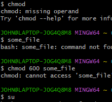


**Probando el teclado**

Bien, intentemos escribir un poco. Abre una ventana de terminal. Lo primero que debería ver es un *indicador de Shell* que contiene nuestro nombre de usuario y el nombre de la máquina seguido de un signo de dólar. 

**Pwd**

Dado que la interfaz de línea de comandos no puede proporcionar imágenes gráficas del archivo estructura del sistema, debemos tener una forma diferente de representarla	

**CD**

Para cambiar el directorio de trabajo (donde estamos parados en el laberinto) usamos el comando. Para hacer esto, escribimos seguido del nombre de la ruta de trabajo deseada directorio.

**ls** (lista de archivos y directorios)

**less** (ver archivos de texto)

**file** (clasificar el contenido de un archivo

**ls**

El comando se utiliza para: Enumerar el contenido de un directorio

Controlar menos

Una vez iniciado, se mostrará el archivo de texto uno página a página

**Examinará un archivo y nos dirá qué tipo de archivo es.filefile**

Una visita guiada

**cd** en cada directorio.

Se utiliza para enumerar el contenido del directorio.**ls**

Si hay un archivo interesante, utilice el comando para determinar su contenido**. file**

En el caso de los archivos de texto, utilícelos para verlos. **less**

**Manipulación de archivos**

**Cp**

El programa copia archivos y directorios. En su forma más simple, Copia un solo archivo:cp

type - Mostrar información sobre el tipo de comando

which - Localiza un comando

help - Mostrar la página de referencia para la orden interna shell

man - Mostrar una referencia de comandos en línea

**Redirección de E/S**

En esta lección, exploraremos una poderosa característica utilizada por la línea de comandos programas llamados redirección de entrada/salida

Entrada estándar

Muchos comandos pueden aceptar la entrada de una instalación denominada entrada estándar.

**Tuberías**

Lo más útil y potente que podemos hacer con la redirección de E/S es Conecte varios comandos para formar lo que se denominan canalizaciones

**Expansión**

Cada vez que escribimos una línea de comandos y presionamos la tecla enter, bash realiza varios procesos sobre el texto antes de que lleve a cabo nuestra orden

**Expansión de nombre de ruta**

**Expansión de tilde**

**Expansión aritmética**

**Expansión de la abrazadera**

**Expansión de parámetros**

**Comillas dobles**

El primer tipo de cotización que veremos son las comillas dobles.

**Comillas simples**

Cuando necesitamos suprimir todas las expansiones, usamos comillas simples.

**Personajes que escapan**

A veces solo queremos citar un solo personaje.

**Más trucos de barra invertida**

Permisos

Los sistemas operativos tipo Unix, como Linux, difieren de otros sistemas informáticos sistemas en el sentido de que no solo son multitarea, sino también multiusuario

**chmod**

El comando se utiliza para cambiar el permiso de un archivo o directorio.

**Control de trabajo**

En la lección anterior, vimos algunas de las implicaciones de que Linux sea Un sistema operativo multiusuario.

**ps** - Enumere el archivo Procesos que se ejecutan en el sistema

**kill** - Enviar un archivo señal a uno o más procesos (generalmente para "matar" un proceso)

**jobs** -un Forma alternativa de enumerar sus propios procesos

**bg** - Poner un proceso en el fondo

**fg** - Poner un proceso en primer plano

